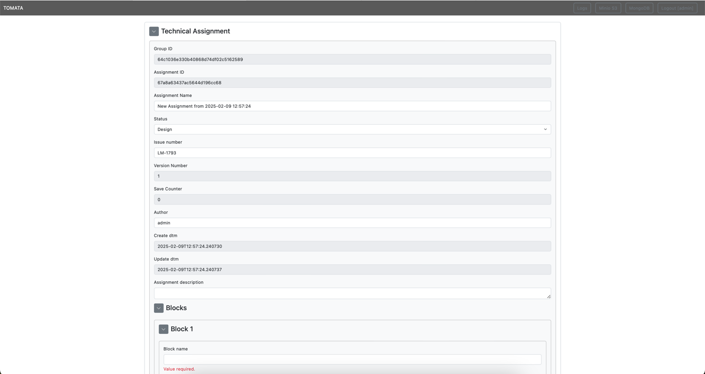
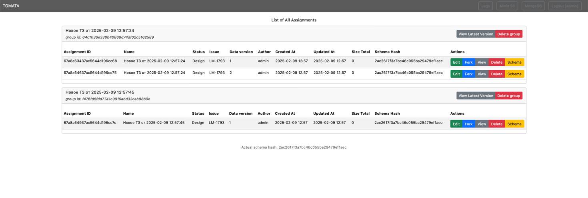
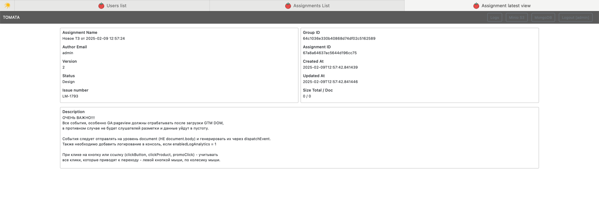

# TOMATA

Tool for documents creation in particular format with automation. 
Lets you create, store and view Documents (Technical Assignments) in particular format. 
Provides role model.

## Usage

*n.b. everywhere Assignemt === Document*

<h4>Interface Example</h4>
[Link to screenshots](#Interface)

<h4>Options for Assignment creation:</h4>

- Just create **new one**, and it will be created with latest available schema (schema - it's amount of fields, their names, in other words - structure of document)
- You can create **new version** of presented assignment (create a fork):
  - Apply **schema of parent** assignment version
  - Apply the **newest available schema**
    - New fields in schema will be empty in that case
    - But if some field dropped from schema - it will be dropped in that new version too

All versions of Assignments completely separate, and not depends on each other.
They store their schema right in the document, so they always contain all information.

Don't confuse two concepts:
- **Data Version** (which means there are two versions of document with same structure (schema), but with different data)
- **Schema Version** (which means there are two documents based on different structure)

If you just add another image, event or block (whatever it will be in future) - it will be same schema still, 
because, for example, `Blocks` - it's `list` field, so it will be just new element in list.
So new element in list doesn't lead to schema change.
But new field - does.

<h4>View modes:</h4>
- View assignment
- View latest version of assignment (aka group)

Each new assignment has their one group_id.  
But if you make fork from assignment (no matter what schema option will be chosen) - it will be forked with same `group_id`,
and in group mode only latest version always will be shown.
 
<h4>List of events and event_data:</h4>
You can change it in `app/config/events_mapper.yaml`. `key`, `value` are mandatory, `comment` optional.

<h4>Assignment default values:</h4>
Can be changed in pydantic models `app/core/models/assignment.py`

Any modification doesn't require restart of the app, and can be donw on the fly. 
If modification hasn't been applied somehow, restart app.
- `docker-compose down`
- `docker-compose up -d`

## Deployment

1. create `.env` from `.env.template` and set envs
2. run `docker-compose up -d` for full run (with database)
3. run `poetry run python script.py` for app only (without database)

## Development

Stack: FastApi, MongoDB (for documents), Minio S3 (for images), [Json-editor](https://github.com/json-editor/json-editor) (Plain JS for UI form creation)

Document (here and everywhere: Document === Assignment) model based on Pydantic.
With additional fields, for Json-editor.

Model can be changed: that will lead to creation of new schema version.

Schema - it's basically tree of Pydantic models

## Testing

1. `poetry shell`
2. `pytest`

## Interface

